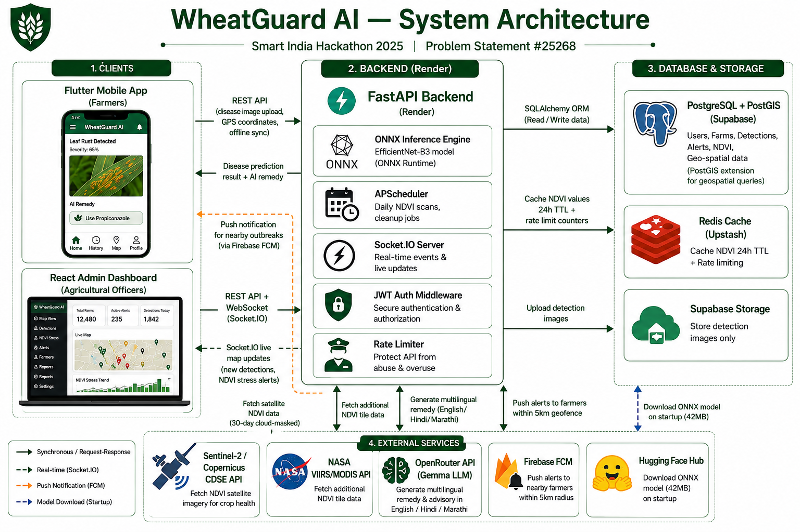

# WheatGuard AI 

An AI-powered wheat disease detection and monitoring platform for Indian farmers.  
Built for **Smart India Hackathon 2025** — Selected in **Top 5 Projects Nationally**.

WheatGuard AI combines mobile disease detection, satellite NDVI monitoring, drone analysis,
and real-time outbreak alerts into one unified system for Indian wheat farmers.

---

##  Live Demo

| Service | Link |
|---|---|
|  Admin Dashboard | [wheatguard-ai.vercel.app](https://wheatguard-ai.vercel.app) |
|  Backend API | [wheatguard-ai.onrender.com](https://wheatguard-ai.onrender.com) |
|  API Docs (Swagger) | [wheatguard-ai.onrender.com/docs](https://wheatguard-ai.onrender.com/docs) |
|  Android APK | [Download APK](https://drive.google.com/file/d/1sq640uyQHicmsm4VjU_ZGyEGEL6z-YPu/view?usp=sharing) |

> **Note:** Backend is hosted on Render free tier — first request after inactivity may take 30-50 seconds to wake up.

---

## Demo Videos

| Demo | Link |
|---|---|
|  Mobile App Demo | [Watch Mobile App Demo](https://drive.google.com/drive/u/0/folders/1BtP6JX5aHjyIPh-mO1HGKTnorw-nyjvn) |

---

##  SIH 2025 Achievement

This project was built for **Smart India Hackathon 2025** and was selected among the
**Top 5 Projects Nationally** in the agriculture and rural development category.

The project addresses a real problem faced by wheat farmers in India — late detection
of crop diseases leading to massive yield loss every year. WheatGuard AI provides
an affordable, multilingual, offline-capable solution that works even in low connectivity
rural areas.

---

##  Problem Statement

| Field | Detail |
|---|---|
| Problem Statement ID | 25268 |
| Title | Early Detection of Wheat Diseases |
| Organization | Ministry of Agriculture & Farmers Welfare (MoA&FW) |
| Department | Department of Agriculture & Farmers Welfare (DoA&FW) — Crops |
| Category | Software |
| Theme | Agriculture, FoodTech & Rural Development |

### Description (as given by the Ministry)

Wheat is affected by several diseases — primarily fungal diseases like rusts, smuts,
powdery mildew, and root and head blights, but also bacterial and viral diseases such
as Black Chaff and Barley Yellow Dwarf Virus (BYDV). These pathogens cause symptoms
ranging from leaf spots and wilting to blighting of the ears and grain, leading to
significant yield losses. Major wheat diseases such as rusts, blight, and Karnal bunt
often spread rapidly, causing widespread crop damage if not detected early.

### Expected Solution

Development of AI/ML-based image recognition tools integrated with drone/satellite
data and mobile apps to provide real-time detection, mapping, and alerts to farmers.

## System Architecture



### How WheatGuard AI Addresses This

| Expected Solution Component | WheatGuard AI Implementation |
|---|---|
| AI/ML-based image recognition | 19-class EfficientNet-B3 ONNX model, detecting all major fungal (rust, smut, blight, Karnal bunt, powdery mildew), bacterial (Black Chaff), and viral (BYDV) diseases |
| Drone data integration | Dedicated Drone Analysis page — officers survey fields, admin reviews AI results and decides whether to alert nearby farmers |
| Satellite data integration | Live Sentinel-2 NDVI (Copernicus CDSE) with cloud masking, plus NASA VIIRS/MODIS — detects crop stress before visible symptoms appear |
| Mobile app for farmers | Flutter app — offline-capable, multilingual (English/Hindi/Marathi), voice input, AI chatbot, text-to-speech remedies |
| Real-time detection, mapping, and alerts | Socket.IO live map updates, FCM push notifications to farmers within a configurable radius, geotagged detection mapping |

---

##  Features

### Mobile App (Flutter)

- Capture or upload wheat crop images
- AI disease detection — online via ONNX model, offline via TFLite
- Multilingual support — English, Hindi, Marathi
- Live disease map with nearby outbreak alerts
- Detection history with PDF export
- Field registration with GPS polygon boundary mapping
- Push notifications for nearby disease outbreaks via Firebase FCM
- AI chatbot for farmer doubts (Krishi Sevak AI)
- Text-to-speech remedy reading
- Voice input for chatbot questions
- Offline-first with automatic sync when back online
- Watermarked photos with GPS coordinates and timestamp

###  Admin Dashboard (React)

- Real-time disease detection dashboard with live stats
- Live disease map with heatmap and satellite NDVI overlay
- Drone image analysis with review-then-alert workflow
- NDVI stress monitoring using Sentinel-2 and NASA VIIRS
- Multi-source alert management — NDVI stress, drone, and mobile alerts
- Reports with CSV and PDF export
- Live WebSocket feed for new detections
- JWT-based admin authentication
- Resolve/reopen lifecycle for detections and NDVI stress alerts
- Auto-refresh and notification settings

###  Backend (FastAPI)

- 19-class EfficientNet-B3 ONNX wheat disease model
- Sentinel-2 NDVI via Copernicus CDSE API with 30-day cloud-masked lookback
- NASA VIIRS and MODIS NDVI tile serving
- Real-time Socket.IO broadcasting
- FCM push notifications with 5km geofencing
- Scheduled daily NDVI stress scanning via APScheduler
- PostgreSQL with PostGIS database
- Supabase storage for detection images
- AI remedy generation via OpenRouter (multilingual — English/Hindi/Marathi)
- Redis-backed caching (NDVI values, 24h TTL) and rate limiting
- Bcrypt-hashed admin credentials with constant-time comparison
- Image upload validation — rejects oversized or non-image files

---

##  Project Structure

```
wheatguard-ai/
│
├── backend/                          # FastAPI Python backend
│   ├── app/
│   │   ├── api/                      # API route handlers
│   │   ├── db/                       # SQLAlchemy setup
│   │   ├── ml/                       # ONNX inference engine + AI helper
│   │   ├── models/                   # SQLAlchemy database models
│   │   ├── middleware/               # JWT auth middleware
│   │   ├── utils/                    # Cache, rate limiter, FCM, Supabase
│   │   ├── main.py                   # FastAPI application entry point
│   │   └── scheduler.py              # Scheduled NDVI scan jobs
│   ├── Dockerfile
│   ├── requirements.txt
│   └── .env                          # Secret keys - not in git
│
├── frontend-web/                     # React Admin Dashboard
│   ├── src/
│   │   ├── pages/                    # Dashboard, LiveMap, Alerts, Reports, Drone
│   │   ├── components/               # MapView, DetectionDetailPanel, etc.
│   │   ├── services/                 # Axios API client + Socket.IO client
│   │   └── layout/                   # AdminLayout, Sidebar, Topbar
│   ├── public/
│   │   └── logo.png                  # App logo
│   ├── Dockerfile
│   └── nginx.conf
│
├── frontend_mobile/
│   └── wheat_disease_clean/          # Flutter Mobile App
│       ├── lib/
│       │   ├── pages/                # All app screens
│       │   ├── services/             # API, notification, speech services
│       │   ├── utils/                # Disease names, watermark helper
│       │   └── config.dart           # Base URL configuration
│       └── pubspec.yaml
│
├── docker-compose.yml                # Full stack Docker orchestration
├── .env                              # Root env for Postgres variables
└── .gitignore
```

---

##  Tech Stack

| Layer | Technology |
|---|---|
| Mobile | Flutter 3.35, Dart 3.9 |
| Frontend | React 19, Vite, Leaflet, Recharts |
| Backend | FastAPI, Python 3.10, SQLAlchemy, Uvicorn |
| Database | PostgreSQL 15 with PostGIS |
| Cache / Rate Limiting | Redis (Upstash in production) |
| ML Model | EfficientNet-B3 ONNX (19 disease classes) |
| Offline ML | TFLite (on-device Flutter inference) |
| AI Chatbot | OpenRouter API (multilingual remedy generation) |
| Satellite NDVI | Sentinel-2 via Copernicus CDSE and NASA VIIRS/MODIS |
| Image Storage | Supabase Storage |
| Realtime | Socket.IO |
| Push Notifications | Firebase Cloud Messaging (FCM) |
| Authentication | JWT (JSON Web Tokens) |
| Security | Bcrypt password hashing, Redis-backed rate limiting, image upload validation |
| Containerization | Docker and Docker Compose |
| Hosting | Render (backend), Vercel (frontend), Supabase (database) |
| ML Model Hosting | Hugging Face Hub |

---

##  Getting Started

### Prerequisites

- Docker Desktop installed and running
- Git installed
- API keys for Sentinel, Supabase, OpenRouter, and Firebase

### Clone the Repository

```bash
git clone https://github.com/Prajwal1905/wheatguard-ai.git
cd wheatguard-ai
```

### Add the ONNX Model

The ML model file is too large for GitHub (42MB). Download it and place at:

```
backend/app/ml/wheat_disease_b3.onnx
```

Download link: https://drive.google.com/file/d/1_9LBfR38U32R03_DwxgWtw0XsIW61PJH/view?usp=sharing

Or via Hugging Face:
```bash
wget https://huggingface.co/prajwalshr/wheatguard-disease-detection/resolve/main/wheat_disease_b3.onnx -O backend/app/ml/wheat_disease_b3.onnx
```

---

##  Environment Variables

### Root `.env`

```env
POSTGRES_USER=postgres
POSTGRES_PASSWORD=your_password
POSTGRES_DB=wheatguard
POSTGRES_PORT=5432
```

### `backend/.env`

```env
# Database
DATABASE_URL=postgresql+psycopg2://postgres:your_password@db:5432/wheatguard

# Cache / Rate limiting
REDIS_URL=redis://redis:6379/0

# AI Chatbot
OPENROUTER_API_KEY=your_openrouter_key

# Sentinel-2 NDVI
SENTINEL_CLIENT_ID=your_sentinel_client_id
SENTINEL_CLIENT_SECRET=your_sentinel_secret
SENTINEL_INSTANCE_ID=your_sentinel_instance_id

# Supabase Storage
SUPABASE_URL=your_supabase_url
SUPABASE_SERVICE_ROLE_KEY=your_supabase_key
SUPABASE_BUCKET=detections

# Firebase Push Notifications
FCM_SERVER_KEY=your_fcm_server_key

# Admin Authentication
ADMIN_EMAIL=admin@yourdomain.com
# Generate: python -c "import bcrypt; print(bcrypt.hashpw(b'your_password', bcrypt.gensalt()).decode())"
ADMIN_PASSWORD_HASH=your_bcrypt_hash
# Generate: python -c "import secrets; print(secrets.token_hex(32))"
ADMIN_SECRET=your_jwt_secret_key
```

### `frontend-web/.env`

```env
VITE_API_BASE=http://localhost:8000
```

---

##  Running with Docker

```bash
# Build and start all services
docker-compose up --build

# Start in background
docker-compose up --build -d

# Stop all services
docker-compose down
```

### Access the Application

| Service | URL |
|---|---|
| Admin Dashboard | http://localhost |
| Backend API | http://localhost:8000 |
| API Docs Swagger | http://localhost:8000/docs |
| Database | localhost:5432 |
| Redis | localhost:6379 |

---

##  Flutter Mobile App

### Setup

```bash
cd frontend_mobile/wheat_disease_clean
flutter pub get
```

### Configure Backend URL

Open `lib/config.dart`:

```dart
class AppConfig {
  // Production server
  static const String baseUrl = "https://wheatguard-ai.onrender.com";

  // For local testing (hotspot)
  // static const String baseUrl = "http://YOUR_LAPTOP_IP:8000";
}
```

### Run on Device

```bash
flutter run
```

### Build Release APK

```bash
flutter build apk --release
```

APK location: `build/app/outputs/flutter-apk/app-release.apk`

### Download APK

[ Download WheatGuard APK](https://drive.google.com/file/d/1sq640uyQHicmsm4VjU_ZGyEGEL6z-YPu/view?usp=sharing)

---

##  Model Training

The EfficientNet-B3 model was trained on Kaggle using a custom wheat disease dataset
with 19 classes including various rust types, blights, insects, and healthy crops.

**Kaggle Notebook:** https://www.kaggle.com/code/prajwalkhade/notebook8c36116641  
**Hugging Face Model:** https://huggingface.co/prajwalshr/wheatguard-disease-detection

### Training Details

| Parameter | Value |
|---|---|
| Architecture | EfficientNet-B3 |
| Input Size | 380 x 380 pixels |
| Number of Classes | 19 |
| Framework | PyTorch |
| Export Format | ONNX for backend, TFLite for mobile |
| Training Platform | Kaggle GPU T4 x2 |

---

##  API Documentation

Live API docs: **https://wheatguard-ai.onrender.com/docs**

### Key Endpoints

| Method | Endpoint | Description |
|---|---|---|
| POST | /detections/predict | Predict disease from image |
| GET | /detections/map_data | Get all detections for map |
| PATCH | /detections/{id}/resolve | Mark detection as resolved |
| PATCH | /detections/{id}/reopen | Reopen a resolved detection |
| POST | /drone/analyze | Analyze drone image |
| POST | /drone/detections/{id}/alert | Send alert to nearby farmers |
| GET | /api/sentinel_ndvi_value | Get Sentinel-2 NDVI for location |
| POST | /api/sentinel_ndvi_polygon | Get NDVI for field polygon |
| GET | /api/ndvi/stress | Get active NDVI stress alerts |
| POST | /api/ndvi/stress/scan | Run NDVI stress scan |
| GET | /fields/ | Get all registered fields |
| POST | /admin/login | Admin login — returns JWT token |
| POST | /ai/chat | AI chatbot reply for farmers |
| POST | /ai/remedy | Get multilingual remedy for disease |
| POST | /fcm/register | Register device FCM token |
| POST | /sync/local-detection | Sync offline mobile detection |

---

##  Disease Classes

The model detects 19 wheat conditions:

| Class | Disease | Type |
|---|---|---|
| 1 | Aphid | Insect |
| 2 | Black Rust | Fungal |
| 3 | Blast | Fungal |
| 4 | Brown Rust | Fungal |
| 5 | Common Root Rot | Fungal |
| 6 | Fusarium Head Blight | Fungal |
| 7 | Leaf Blight | Fungal |
| 8 | Mildew | Fungal |
| 9 | Mite | Insect |
| 10 | Septoria | Fungal |
| 11 | Smut | Fungal |
| 12 | Stem fly | Insect |
| 13 | Tan spot | Fungal |
| 14 | Yellow Rust | Fungal |
| 15 | BYDV | Viral |
| 16 | Black Chaff | Bacterial |
| 17 | Karnal Bunt | Fungal |
| 18 | Powdery Mildew | Fungal |
| 19 | Healthy | — |

---

## Author

**Prajwal Khade**

- GitHub: https://github.com/Prajwal1905
- Email: prajwalkhade19@gmail.com
- Kaggle: https://www.kaggle.com/prajwalkhade

---

##  Acknowledgements

- Smart India Hackathon 2025 — Top 5 Selection
- Copernicus Data Space Ecosystem for Sentinel-2 satellite data
- NASA EARTHDATA for VIIRS and MODIS NDVI
- OpenRouter for AI chatbot API access
- Supabase for image storage and database
- Firebase for push notification infrastructure
- Hugging Face for ML model hosting
- Render and Vercel for free hosting

---

*This project was built to help Indian wheat farmers protect their crops using
artificial intelligence, satellite technology, and real-time monitoring —
making advanced agricultural tools accessible to every farmer.*
